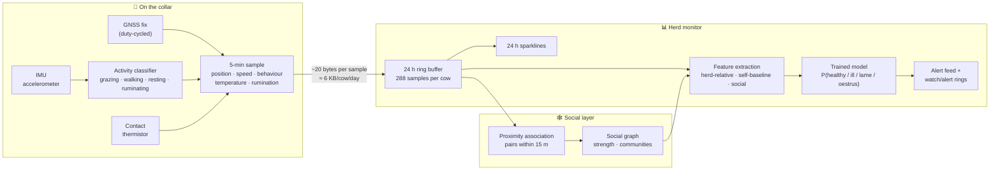

# Collar telemetry

Source: `src/sim/herd.ts` (generation), `src/sim/types.ts` (schema),
`src/sim/features.ts` (feature derivation). Every cow emits the data stream a real collar
reports — and the [detection layer](./detection) is only allowed to see this stream, never
the simulation's internal state.

## The pipeline at a glance



Everything in the "on the collar" box is derived on-device; everything to the right is
what this demo implements. The collar reports *derived telemetry* — a compact 5-minute
summary — not raw sensor data, which is what keeps the data volume tiny.

## The telemetry sample

Every **5 sim-minutes** each collar records a sample:

| Field | Type | What it is | How a real collar gets it |
| --- | --- | --- | --- |
| `t` | timestamp | Sample time | RTC / GPS time |
| `x`, `y` | metres | Position | GNSS fix (duty-cycled to save power) |
| `speed` | m/s | 5-minute average speed | Successive GNSS fixes + accelerometer |
| `behaviour` | enum | `grazing` / `walking` / `resting` / `ruminating` | On-collar activity classifier over IMU data — head position and jaw/ear movement patterns |
| `temperature` | °C | Body temperature | Contact thermistor (or ear-tag partner device) |
| `rumination` | 0–1 | Fraction of recent time ruminating | Accumulated from the activity classifier |

As JSON (the demo's in-memory form — a real feed would pack this far smaller):

```json
{
  "t": 1834,
  "x": 287.4, "y": 141.2,
  "speed": 0.11,
  "behaviour": "grazing",
  "temperature": 38.7,
  "rumination": 0.31
}
```

### Compact by design

Packed as binary, this is **~20 bytes per sample**: position quantised to the paddock
(2 × 2 bytes), speed (1), behaviour class (2 bits), temperature offset (1), rumination
(1), timestamp delta (2), plus header. At one sample per 5 minutes that is **~6 KB per
cow per day**, because the collar sends *derived telemetry*, not raw sensor data. The
heavy lifting — activity classification, fence logic — runs on-collar; only the compact
summary and alerts leave the device.

## How each signal behaves in the sim

- **Speed** — 5-minute EWMA of true movement. Grazing ≈ 0.12 m/s, walking ≈ 1 m/s,
  resting/ruminating ≈ 0. Each cow has a persistent ±15% pace factor, so healthy cows
  genuinely differ — the detector has to cope with that.
- **Behaviour** — the state machine's current state, i.e. a perfect activity classifier.
  (A real classifier is ~90–95% accurate; adding label noise here would be a
  straightforward extension.)
- **Temperature** — relaxes towards 38.6 °C + a ±0.25 °C diurnal cycle + condition
  offsets ([illness](./health-conditions) adds +1.4 °C) + a herd-wide heat-stress term
  ([weather](./weather)). Fevers develop over ~1.5 h, as in practice.
- **Rumination** — EWMA (~2 h) of time-in-rumination, shown as min/h in the UI. A healthy
  cow runs ~20 min/h averaged over the day. Illness collapses the underlying behaviour,
  so the reported rate decays over an hour or two — a leading indicator, and exactly the
  signal commercial rumination collars are sold on.

## The ring buffer

Each cow keeps **24 hours of samples (288)**. Everything downstream reads this buffer:

- the sidebar's 24-hour **sparklines** (cow vs. herd mean),
- the detector's **2-hour feature window** (recent behaviour),
- the detector's **own-baseline window** (2–24 h ago) — used to compute
  *self-relative deltas*, which separate "naturally slow cow" from "cow that just went
  slow" (see [detection features](./detection#features)).

## Why synthetic telemetry is the right demo choice

The generator and the detector are **strictly separated**: conditions are injected into
the behaviour model, and the detector must recover them from the telemetry alone. That
makes the demo falsifiable — inject a condition, watch whether and how fast the detector
finds it — which is a far stronger portfolio claim than a dashboard drawn over canned
data. The same separation is what made [training a real model](./detection#the-trained-model)
possible: the simulator generates unlimited labelled telemetry.
